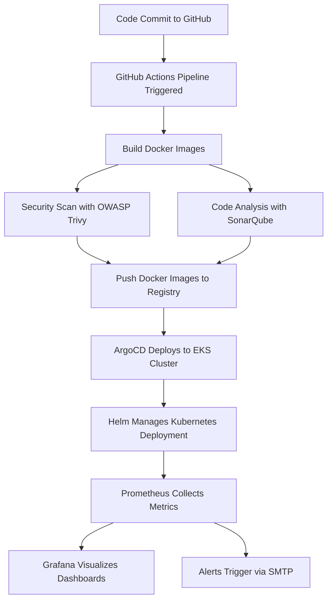

# MERN Stack Movies App 
## DevSecOps | GitOps
### K8s |AWS EKS | GitHub Actions | Docker | OWASP | Trivy | SonarQube | Docker | Helm | Prometheus | Grafana | ArgoCD

## Project Overview

The Movie Recommendation application is a full-stack MERN (MongoDB, Express, React, Node.js) project designed to provide personalized movie recommendations to users. The application features user authentication, interactive movie listings, ratings, and recommendation algorithms based on user preferences. The focus is on secure, automated, and observable deployment pipelines. The pipeline covers containerization, automated CI/CD, security scanning, GitOps deployment, monitoring, and alerting, providing an end-to-end DevSecOps workflow.

Key DevOps practices implemented:

- Containerization with Docker
- Automated CI/CD pipelines using GitHub Actions
- Security scanning with OWASP Dependency Check, Trivy, and SonarQube
- Kubernetes (EKS on AWS) for orchestration and scaling
- Helm charts for simplified deployment and versioning
- Monitoring & observability with Prometheus and Grafana
- AWS Cloud Infrastructure for hosting and scaling
- ArgoCD for kubernetes based GitOps
- SMTP service for email alerts
- Application Stack: MongoDB, Express.js, React.js, Node.js

## Architecture



## Tech Stack

### Cloud & Orchestration
- **AWS Cloud** -> Hosting & infrastructure
- **Amazon EKS (Elastic Kubernetes Service)** -> Kubernetes orchestration and scaling

### Containerization & Deployment
- **Docker** -> Containerization of frontend and backend
- **Helm** -> Deployment templates and versioning
- **Kubernetes** -> Orchestration of services

### CI/CD & Automation
- **GitHub Actions** -> Continuous integration and delivery pipelines
- **Argo CD** -> GitOps-based continuous deployment to Kubernetes

### Security & Code Quality
- **OWASP Dependency Check** -> Dependency vulnerability scanning
- **Trivy** -> Container image security scanning
- **SonarQube** -> Code quality and static analysis

### Monitoring & Observability
- **Prometheus** -> Metrics collection and monitoring
- **Grafana** -> Dashboards and visualization

## Implementation

1. **AWS Configuration**

An AWS Instance was created with all nessecary configurations and limitations to serve as the master machiene for the project.

2. **Containerisation with docker**

The application was containerized using Docker to ensure consistent behavior across all environments. Docker containers provide isolated, lightweight environments that simplify testing and deployment. Dockerfiles were created in the backend/ and frontend/ directories, images were built locally using docker build, and functionality was verified by running the containers locally. 

3. **CI/CD Integration - Jenkins**

A CI/CD pipeline was implemented using GitHub Actions to automate the building, testing, and deployment of the Movie Reccomendation App. The pipeline is triggered on commits to the main branch, automatically building Docker images for both backend and frontend, running automated tests, and pushing the images to a container registry. Deployment is automated by pulling these images to the target environment, ensuring that updates are delivered reliably and consistently. This setup enables rapid and repeatable deployments, reduces manual errors, and maintains synchronization between code changes and the running application. GitHub Actions workflows were configured with the necessary secrets, environment variables, and runners to execute the pipeline efficiently.


4. **EKS Cluster Setup**

After installing and configuring Jenkins, an EKS (Elastic Kubernetes Service) cluster was created to serve as the deployment environment for the Movie recommendation application. The cluster provides a scalable and managed Kubernetes infrastructure to run the containerized backend and frontend services. Jenkins was configured with credentials and access to the EKS cluster, enabling automated deployment of Docker images. Kubernetes manifests were applied to the cluster. This setup allows the application to run in isolated pods with proper networking, scaling, and load balancing, ensuring high availability and reliability. 

Kubectl was installed, Eksctl installed, Associate IAM OIDC Provider was given and a nodegroup was created.

5. **OWASP, Trivy and SonarQube integration**

To ensure the security and quality of the movie recommendation application, OWASP, Trivy and SonarQube were integrated into the Github Actions pipeline. OWASP Trivy was used to scan Docker images for vulnerabilities, identifying any security risks in both backend and frontend containers before deployment. SonarQube was configured to analyze the source code for bugs, code smells, and maintainability issues, providing detailed reports on code quality. These tools were incorporated as pipeline stages in GitHub actions, so that any security vulnerabilities or critical code quality issues automatically fail the build, preventing unsafe or low-quality code from being deployed. This integration enforces robust security practices and maintains high code standards throughout the development lifecycle.


6. **ArgoCD Setup**

ArgoCD was integrated to implement a GitOps approach for managing the application on the EKS cluster. All Kubernetes manifests for the backend and frontend, including Deployment, Service, and Ingress files, were stored in a dedicated Git repository. ArgoCD continuously monitors this repository and automatically synchronizes the cluster state with the Git configuration. Any changes pushed to the repository, such as updated container images or configuration updates, are detected by ArgoCD and applied to the cluster without manual intervention. This ensures a declarative, version-controlled, and reliable deployment process, maintaining consistency between the Git repository and the live application environment.


7. **SMTP Configuration**

SMTP was configured to enable the application to send email notifications, such as account verification, password resets, and system alerts. This setup was also integrated into the GitHub Actions pipeline to send notifications for build status, deployment success, or failures, providing real-time visibility into the CI/CD process.

The app was built on ArgoCD and ensured that all kubernetes manifests were healthy.

8. **Pipeline Build**

All pipelines were built using GitHub Actions.

9. **Helm Installed and Prometheus-Grafana repositories added**

Helm was installed to simplify the deployment and management of applications on the EKS cluster. Using Helm, Prometheus and Grafana repositories were added to enable monitoring of the application. Prometheus collects metrics from the cluster and application pods, while Grafana visualizes these metrics through customizable dashboards. This setup provides real-time insights into application performance, resource usage, and system health. Helm charts were used to manage the installation and configuration, ensuring consistent and reproducible deployments of the monitoring stack across the cluster.

10. **Prometheus-Grafana**

Prometheus and Grafana were deployed on the EKS cluster to provide comprehensive monitoring of the application. Prometheus collects metrics from the application pods, Kubernetes nodes, and cluster resources, tracking CPU, memory, network usage, and application-specific metrics. Grafana consumes these metrics to create interactive dashboards, allowing visualization of system performance and health in real time. Alerts were configured in Prometheus for critical thresholds, enabling proactive response to performance issues or failures. This monitoring setup ensures operational reliability, observability, and quick troubleshooting across the application environment.


## Steps

1. Creation of EC2 Master Instance in AWS Console with 2CPU, 8GB of RAM (t2.large) and 29 GB of storage.

2. Create a docker network
  ```bash
      sudo apt-get install docker.io -y
      sudo usermod -aG docker ubuntu && newgrp docker
      docker network create <Network-Name>
  ```

3. Run MONGO container
  ```bash
        docker run --network=<Network-Name> --name mongo -d -p 27017:27017 mongo
  ```


4. Run Backend container
  ```bash
        docker run --network=<Network-Name> --name backend -d -p 3000:3000 sidraut007/movie-back
  ```

  
5. Run Application container
  ```bash
        docker run --network=<Network-Name> --name frontend -d -p 5173:5173 sidraut007/movie-front
  ```
 Verify deployment
  ```bash
      docker ps
  ```


6. Importing local database

      ```bash

      docker cp ./dump/moviesApp <Mongo_Container_Name>:/data/moviesApp

      docker exec -it <Mongo_Container_Name> bash

      mongorestore --db moviesApp /data/moviesApp

      ```

 Using docker-compose deployment
      ```bash
            docker compose up -d
      ```

7. Configure the pipelines on GitHub Action directly from code repository in GitHub. Attach neccesary credentials to GitHub Actions.


8. Create EKS Cluster on AWS (Master machine), add IAM user, obtain access keys, and configure AWS CLI.
    ```bash
        curl "https://awscli.amazonaws.com/awscli-exe-linux-x86_64.zip" -o "awscliv2.zip"
    sudo apt install unzip
    unzip awscliv2.zip
    sudo ./aws/install
    aws configure
    ```
9. Install Kubectl and Eksctl
    ```bash
        curl -o kubectl https://amazon-eks.s3.us-west-2.amazonaws.com/1.19.6/2021-01-05/bin/linux/amd64/kubectl
    chmod +x ./kubectl
    sudo mv ./kubectl /usr/local/bin
    kubectl version --short --client

    curl --silent --location "https://github.com/weaveworks/eksctl/releases/latest/download/eksctl_$(uname -s)_amd64.tar.gz" | tar xz -C /tmp
    sudo mv /tmp/eksctl /usr/local/bin
    eksctl version
    ```
10. Create EKS Cluster, provide OIDC and create Nodegroup.
    ```bash
    eksctl create cluster --name=movie-app \
                    --region=us-east-1 \
                    --version=1.30 \
                    --without-nodegroup

    eksctl utils associate-iam-oidc-provider \
                    --region us-east-1 \
                    --cluster movie-app \
                    --approve

    eksctl create nodegroup --cluster=movie-app \
                     --region=us-east-1 \
                     --name=movie-app \
                     --node-type=t2.large \
                     --nodes=2 \
                     --nodes-min=2 \
                     --nodes-max=2 \
                     --node-volume-size=29 \
                     --ssh-access \
                     --ssh-public-key=eks-nodegroup-key

11. Install and Configure SonarQube on Master Instance, add to instance security group and expose on port 9000.

    ```bash 
    docker run -itd --name SonarQube-Server -p 9000:9000 sonarqube:lts-community
    ```

12. Install Trivy.
    ```bash
        sudo apt-get install wget apt-transport-https gnupg lsb-release -y
    wget -qO - https://aquasecurity.github.io/trivy-repo/deb/public.key | sudo apt-key add -
    echo deb https://aquasecurity.github.io/trivy-repo/deb $(lsb_release -sc) main | sudo tee -a /etc/apt/sources.list.d/trivy.list
    sudo apt-get update -y
    sudo apt-get install trivy -y
    ```

13. Install and configure ArgoCD on the cluster.
    ```bash
    kubectl create namespace argocd
    kubectl apply -n argocd -f https://raw.githubusercontent.com/argoproj/argo-cd/stable/manifests/install.yaml
    watch kubectl get pods -n argocd
    sudo curl --silent --location -o /usr/local/bin/argocd https://github.com/argoproj/argo-cd/releases/download/v2.4.7/argocd-linux-amd64sudo chmod +x /usr/local/bin/argocd
    ```
    Patch ArgoCD Server as a NodePort and access it on the browser.
    ```bash
    kubectl patch svc argocd-server -n argocd -p '{"spec": {"type": "NodePort"}}'
    ```

14. Allow port 465 on master instance for SMTPS notifications. Configure it in corresponding google account and Jenkins Master. Test the SMTP connection.

15. Add credentials to DockerHub for the built images to be pushed.

16. Build and automate pipelines on GitHub Actions. Complete CI/CD.

17. Add the EKS Cluster to ArgoCD for application deployment.
    ```bash 
    argocd cluster add Chat-app@chat-app.us-east-1.eksctl.io --name chat-app-eks-cluster
    ```
    Open ArgoCD, add repositories and build the application.

18.  Install Helm Chart and add helm repository for Prometheus and Grafana.
    ```bash
    curl -fsSL -o get_helm.sh https://raw.githubusercontent.com/helm/helm/main/scripts/get-helm-3
    chmod 700 get_helm.sh
    ./get_helm.sh

    helm repo add stable https://charts.helm.sh/stable

    helm repo add prometheus-community https://prometheus-community.github.io/helm-charts
    ```
    ```bash
    helm install stable prometheus-community/kube-prometheus-stack -n prometheus

    kubectl get svc -n prometheus
    ```

    ```bash
    Expose it as a NodePort and access on browser. 
    Expose Grafana similiarly and access it on browser.

19.  Gather metrics and monitor app data.

20. Clean up and delete Cluster.
    ```bash
    eksctl delete cluster --name=movie-app --region=us-east-1
    ```

---


     


